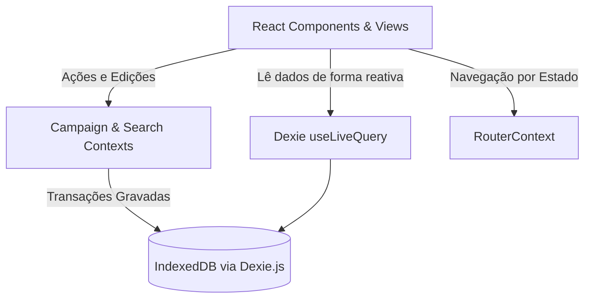

# 🏰 Arquitetura do Sistema — Histórias que Rolamos

Este documento detalha o desenho arquitetural do **Histórias que Rolamos** (ou *Crônicas da Jornada*), descrevendo a organização de dados, fluxos de controle de estado, infraestrutura de roteamento e padrões de sincronização offline-first.

---

## 🗺️ Visão Geral da Arquitetura

A aplicação segue uma arquitetura baseada em **Componentes React Funcionais** sob um fluxo de dados unidirecional, alimentado por um banco de dados local transacional de alta performance (IndexedDB) e gerenciado por Contextos React dedicados:

---

## 💾 Modelagem de Dados e Armazenamento (Dexie/IndexedDB)

Para permitir a operação 100% offline-first sem latência de rede, os dados estruturados e arquivos binários de mídia são gravados em tabelas IndexedDB locais por meio do **Dexie.js**.

### Schema do Banco de Dados (`src/db/index.ts`)
O banco possui as seguintes tabelas e chaves de indexação rápida:

1. **`campaigns`**:
   - `id`: Chave primária (UUID string).
   - *Indexes*: `name` (para ordenação rápida).
2. **`characters`**:
   - `id`: Chave primária (UUID).
   - *Indexes*: `campaignId`, `name` (busca e filtragem por campanha).
3. **`memories`**:
   - `id`: Chave primária (UUID).
   - *Indexes*: `campaignId`, `eventDate` (ordenação cronológica da linha do tempo), `*characterIds` (multi-indexação de participantes), `*tags` (multi-indexação para buscas rápidas).
4. **`tokens`**:
   - `id`: Chave primária (UUID).
   - *Indexes*: `campaignId`, `category` (separação entre PCs, NPCs e Inimigos).
5. **`memoryCharacters`**:
   - `[memoryId+characterId]`: Chave primária composta para mapear a associação muitos-para-muitos.
   - *Indexes*: `characterId`, `memoryId`. Esta tabela registra especificamente os marcos em que heróis evoluíram de nível durante uma memória cronológica.
6. **`media`**:
   - `id`: Chave primária (UUID).
   - *Indexes*: `campaignId`. Salva os metadados de imagens e os arquivos brutos binários (`blob` de alta resolução e `thumbnailBlob` otimizado em 300x300 pixels).
   - Campo `isGallery` (boolean): Define se o arquivo é uma imagem de galeria (`true`) ou um anexo/documento (`false`).

---

## 🧭 Arquitetura de Roteamento (`RouterContext`)

Para atender aos requisitos de compatibilidade offline e empacotamento PWA, a aplicação implementa um roteador customizado baseado em estados no React (`RouterContext.tsx`):

* **Funcionamento**: A navegação intercepta as ações do usuário e atualiza um estado `view: ViewState` contendo o tipo de tela ativa (`dashboard`, `timeline`, `characters`, `character-profile`, `memory-detail`, `gallery`, `settings`) e os parâmetros adicionais (como `id` do personagem ou `tab` ativo na galeria).
* **Gallery Tabs**: A aba `gallery` agora suporta três valores: `images` (galeria de imagens), `files` (arquivos e fichas PDF) e `tokens` (tokens de combate).
* **Histórico local**: Mantém uma pilha de navegação em memória (`historyStack: ViewState[]`). Isso alimenta o botão **"Voltar"** dinâmico do cabeçalho de forma limpa.
* **Deep Links**: O roteador sincroniza o estado ativo com a hash da URL (`window.location.hash`). Ao recarregar a página, a aplicação decodifica o hash de volta para o estado inicial, garantindo que o usuário retorne à mesma tela ativa.

---

## ⚡ Gerenciamento de Estado Global

O estado global da campanha ativa é propagado via React Contexts:

* **`CampaignContext`**:
  - Encapsula a campanha selecionada pelo usuário.
  - Disponibiliza funções para salvar edições de imagem da campanha, alternar campanhas, registrar novas, ou resetar o grimório completo (limpeza física de tabelas no IndexedDB).
* **`SearchContext`**:
  - Propaga a string de busca inserida no cabeçalho global.
  - É escutada de forma unificada pelas listagens de personagens, crônicas e galeria, permitindo filtros integrados imediatos.

---

## 🎨 Design System e Performance

### Separação de Mídia
O sistema implementa uma flag `isGallery` no modelo `Media` para categorizar arquivos:
- **`isGallery: true`**: Imagens de cenário, ilustrações de memórias, mapas, NPCs.
- **`isGallery: false`**: Fichas de personagem (PDFs), documentos anexados.
- **Tokens**: Armazenados em tabela separada (`tokens`), não aparecem na galeria de imagens.

### Pipeline de Mídia Estendido
O `MediaService.saveMedia()` agora aceita um parâmetro `isGallery` que é passado pelos modais:
- `MemoryModal` passa `true` para ilustrações de memórias.
- `GalleryImageModal` passa `true` para artes da campanha.
- `CharacterModal` passa `false` para fichas de personagem.
- `TokenModal` passa `false` para imagens de tokens.

Isso permite que a `GalleryView` filtre os arquivos corretamente nas três abas distintas.

## 🔄 Fluxos de Dados Relevantes

### Criação de Memória com Ilustração
1. Usuário abre `MemoryModal` e envia uma imagem.
2. `MemoryModal` chama `MediaService.saveMedia(file, campaignId, true)`.
3. A imagem é salva com `isGallery: true` e retorna um `mediaId`.
4. O `memoryId` e `imageId` são salvos em IndexedDB.
5. Na galeria, `GalleryView` filtra `media` onde `isGallery === true` para exibir na aba "Imagens".

### Anexo de Ficha de Personagem
1. Usuário abre `CharacterModal` e anexa um PDF.
2. `CharacterModal` chama `MediaService.saveMedia(file, campaignId, false)`.
3. O arquivo é salvo com `isGallery: false` e retorna um `mediaId`.
4. O `sheetMediaId` é salvo no registro do personagem.
5. Na galeria, `GalleryView` filtra `media` onde `isGallery === false` para exibir na aba "Arquivos e Fichas".

* **Micro-interações**: Hover scales de 102% com suavização de tempo (`transition-all duration-300`) e gold text shadows (`glow-gold-text`) são aplicados a botões e cards da grife *Grimoire Glass*.
* **Otimização de Renderização**: Consultas de banco de dados são assinadas de forma reativa pelo custom hook `useLiveQuery` da biblioteca `dexie-react-hooks`. Isso atualiza os componentes apenas quando as tabelas do IndexedDB sofrem mutação, prevenindo re-renderizações desnecessárias.
* **Divisão de Chunks**: A configuração do bundler (`vite.config.ts`) separa as bibliotecas mais pesadas (`jszip` e `lucide-react` ícones) em arquivos JS paralelos (`vendor-jszip.js` e `vendor-icons.js`), o que acelera a primeira pintura e melhora a eficiência de cache do Service Worker.
