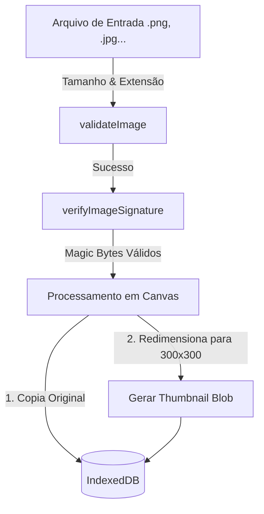

# 🖼️ Arquitetura de Mídia e Segurança — Histórias que Rolamos

Este documento descreve as diretrizes, fluxos de validação e otimização de imagens locais do aplicativo **Histórias que Rolamos**. Como um diário de campanha offline-first, a eficiência do ciclo de vida das imagens é crucial para evitar travamentos de memória no navegador.

---

## 🔄 Fluxo de Processamento de Mídia

Toda imagem adicionada à campanha (capa, portratos de personagens, crônicas e tokens) passa pelo pipeline unificado de validação, verificação de segurança e otimização por canvas antes de persistir no IndexedDB:

---

## 🔒 Engine de Validação e Segurança de Assinatura (Magic Bytes)

Para proteger a integridade da aplicação local e prevenir adulteração de extensões de arquivos maliciosos, implementamos uma validação em duas etapas:

1. **Validação Superficial (`validateImage` em `src/services/media.ts`)**:
   - Rejeita imediatamente arquivos maiores que **15MB**.
   - Filtra os tipos MIME contra a lista de formatos aceitos (JPEG, PNG, WEBP, GIF, BMP, SVG, TIFF, AVIF).
2. **Inspeção de Assinatura Binária (`verifyImageSignature`)**:
   - Lê os primeiros **8 bytes** do arquivo assincronamente como um `ArrayBuffer` usando o `FileReader`.
   - Compara os cabeçalhos com as assinaturas de formatos (Magic Numbers):
     - **PNG**: `89 50 4E 47`
     - **JPEG/JPG**: `FF D8 FF`
     - **GIF**: `47 49 46 38`
     - **WEBP**: `RIFF` (posição 0-3) e `WEBP` (posição 4-7)
     - **BMP**: `42 4D`
   - Se o arquivo declarar uma extensão (ex: `.png`) mas seus bytes iniciais não corresponderem à assinatura oficial do PNG, o arquivo é imediatamente rejeitado.

---

## 📐 Pipeline de Otimização e Miniaturas em Canvas (`src/services/media.ts`)

Para garantir que grades visuais (como a listagem da Galeria de Imagens e a Linha do Tempo) carreguem em poucos milissegundos sem estourar o limite de memória da aba (Heap Memory limits):

* **Miniaturas Otimizadas (`generateThumbnail`)**:
  - Carrega a imagem original em um objeto `Image` em memória via `URL.createObjectURL(file)`.
  - Calcula a proporção para caber em um contêiner quadrado de no máximo **300x300 pixels** (mantendo a proporção de tela original).
  - Desenha a imagem redimensionada em um elemento `<canvas>` virtual.
  - Exporta o canvas como um `Blob` comprimido (usando `image/jpeg` com qualidade de 80% ou mantendo transparência se o arquivo de entrada for um PNG).
* **Resolução de Alta Qualidade**:
  - Mantém o arquivo binário original original intacto no IndexedDB.
  - O arquivo original de alta resolução só é instanciado na memória do navegador quando o usuário clica na imagem para expandi-la em tela cheia ou solicita o download.

---

## 📦 Pipeline de Descompactação ZIP e Restauração de Backups

Durante a importação de um backup ZIP completo da campanha:

1. O arquivo `.zip` é lido assincronamente usando a biblioteca **JSZip**.
2. O arquivo JSON contendo os registros relacionais é analisado.
3. Para cada registro de imagem encontrado no metadados, o pipeline busca o arquivo binário correspondente na pasta `/media` do ZIP.
4. O binário recuperado é extraído como um `Blob`.
5. **Reconstrução Dinâmica**: Para garantir compatibilidade e limpar eventuais corrupções, o pipeline reprocessa o Blob recuperado do ZIP no canvas virtual, re-gerando as miniaturas de visualização 300x300 pixels antes de persistir o registro no banco IndexedDB.
